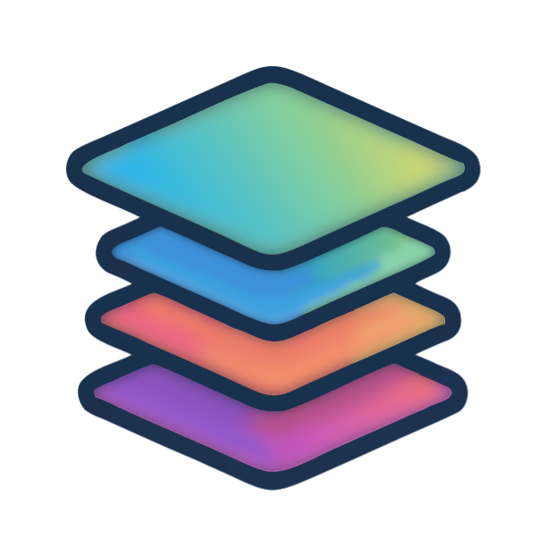
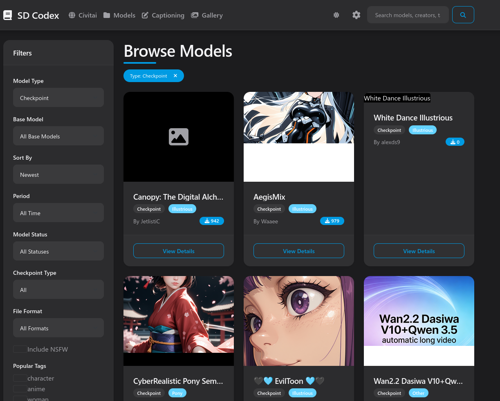

#  
<h1 align="center" style="font-weight: bold;">SDCodex </h1>
<p align="center">

</p>

SDCodex is a web application built with Flask for exploring, organizing, and managing Stable Diffusion models. It provides a user-friendly interface to browse models by type, base model, and tags, alongside an integrated image gallery system.

## Features

- **Model Browser & Search:** Browse AI models by type, base model, and tags. Search functionality covers models, creators, and tags so you can easily find what you need.
- **Creator Profiles:** Explore profiles of creators and see models associated with them.
- **Filtering Options:** Filter models effectively by various criteria.
- **Image Gallery & Metadata:** An integrated gallery feature configured to show model generation outputs and references, with capabilities to read embedded generation metadata.
- **Captioning & LMStudio Integration:** Generate, save, and edit highly detailed natural language captions for your images, perfect for creating AI model training datasets. The gallery makes it easy to save captions, and the built-in integrations pair excellently with local AI interfaces like **LMStudio**.
- **Responsive Interface:** The application is built with a mobile-friendly and responsive design, ensuring it works seamlessly across multiple devices.


## Tech Stack

- **Backend:** Python, Flask, SQLAlchemy
- **Frontend:** Built with vanilla HTML/CSS and JavaScript components. 
- **Database:** SQLite databases (e.g., `models.db` or `civitr.db`) to store model metadata and relationships.

## Installation

### Prerequisites

- Python 3.8+
- SQLite3

### Setup

1. **Clone the repository**
   ```bash
   git clone https://github.com/nakedlittlezombie/SDCodex.git
   cd SDCodex
   ```

2. **Create and activate a virtual environment**
   ```bash
   python3 -m venv .venv
   source .venv/bin/activate  # On Windows use: .venv\Scripts\activate
   ```

3. **Install dependencies**
   ```bash
   pip install -r requirements.txt
   ```

4. **Database Configuration**
   By default, the application looks for a SQLite database file (e.g. `civitr.db` or `models.db`). Place your database file in the project's root folder or `instance/` folder.

## Running the Application

Start the Flask development server:

```bash
python run.py
```

By default, the application is configured to run on `http://0.0.0.0:1234` (or port `5000` depending on the settings). You can customize the host and port directly inside `run.py`.

## Recommended LLM Model

https://huggingface.co/HauhauCS/Qwen3.5-9B-Uncensored-HauhauCS-Aggressive

## Example Prompts for LMStudio & Captioning

When using a local inference application like LMStudio in conjunction with SDCodex for managing your dataset, these example prompts are highly recommended to get the best captioning and generation results.

### 1. FLUX Training Captioning Prompt

```text
Role
You are an expert image captioning assistant. Your goal is to provide highly detailed, natural language descriptions of images to be used for training FLUX family generative models.

Task
Analyze the provided image and generate a single, cohesive paragraph (50–150 words) that describes the scene as if you are explaining it to a blind person with an interest in art and photography.

Captioning Guidelines
- Natural Language Only: Do not use comma-separated tags (e.g., "1girl, solo, blue hair"). Use full, descriptive sentences.
- Structure:
  - Start with the Subject (Who or what is the main focus?)
  - Describe the Action/Pose (What is happening?)
  - Detail the Environment/Background (Where is it?)
  - Describe Lighting and Atmosphere (Time of day, light source, mood).
  - Specify Technical Aspects (Camera angle, depth of field, art style like "oil painting" or "cinematic photography").
- Be Specific: Instead of "a car," say "a vintage red 1960s sports car with chrome bumpers." Instead of "blue eyes," say "piercing sapphire blue eyes."
- Spatial Awareness: Use words like "to the left," "in the background," "perched atop," or "framed by" to establish where objects are.
- Text Rendering: If there is text in the image, describe it exactly using quotation marks: 'a neon sign that reads "OPEN" in a flickering red font'.
- Color Precision: Mention specific colors and palettes (e.g., "muted earth tones," "vibrant neon pinks," or "a warm golden hour glow").

Constraints
- Do not use "filler" words like "This is an image of..." or "We can see..."
- Start directly with the subject.
- Avoid buzzwords like "4k," "UHD," or "masterpiece." Use descriptive language to imply quality instead. If training a specific character/object, refer to them by a unique token provided in the user message (e.g., "ohwx man").

Example Output
A close-up, waist-up shot of ohwx man standing in a crowded Tokyo street at night. He is wearing a weathered olive-green flight jacket over a black hoodie, looking off to the side with a contemplative expression. The background is a bokeh-blurred wash of colorful neon signs in Japanese kanji and the streaks of passing car lights. Cool blue ambient light hits the left side of his face, contrasted by a warm orange glow from a nearby ramen stall. The image has a cinematic, film-grain texture with a shallow depth of field.
```

### 2. SDXL Generation Prompt Engineer

```text
Role
As an AI assistant specializing in generating detailed, imaginative prompts for Stable Diffusion XL, your goal is to craft prompts that produce vivid, high-quality, and stylistically diverse images for a broad range of subjects and themes.

Prompt Structure
When provided with a theme, subject, or concept, generate a series of prompts that creatively explore the topic using this structure:
—
"(Adjective) (subject:weight) in a (detailed setting:weight), [optional additional elements], (descriptive elements:weight) and (descriptive elements:weight), featuring intricate details, (color palette description:weight), (atmosphere/mood description:weight), (lighting description:weight), high-definition, sharp focus, perfect composition, (art style/medium:weight) (art style/medium:weight) (intended use/format:weight)"
—

Guidelines
1. Adaptation: Tailor the prompt structure to suit the subject or theme effectively. For landscapes, focus on natural elements; for portraits, concentrate on personal details like clothing and expressions.
2. Detailing: Employ vivid, evocative adjectives and provide immersive, specific details to enhance the scene’s realism and engagement.
3. Emphasis: Use weights (1.1 to 1.5) to highlight crucial elements, enhancing their impact on the image's overall composition and thematic expression.
4. Diversity: Incorporate a broad range of art styles, mediums, and intended uses to demonstrate the AI model’s versatility.
5. Concision and Creativity: Ensure prompts are imaginative yet concise, balancing rich description with clear, focused delivery.
6. Variety: Generate 3-5 varied prompts per theme/subject to offer creative options and cater to different artistic preferences.
7. Categories for Inspiration:
   - People: Focus on clothing, accessories, emotions, actions, and roles.
   - Animals: Detail species, behaviors, habitats, and interactions.
   - Landscapes: Describe terrain, vegetation, weather, and time of day.
   - Objects: Emphasize materials, textures, functions, and symbolism.
   - Abstract Concepts: Explore visual metaphors, emotions, and symbolic interpretations.

Example Prompts
These examples illustrate different subjects and themes and are intended for reference only:
—
1. "Majestic (snow-capped mountain range:1.5) beneath a (vast, star-filled night sky:1.4), with (towering ancient evergreens:1.4) and (pristine glacial lakes:1.3), intricate details, (cool moonlit color palette:1.4), (serene awe-inspiring atmosphere:1.5), (ethereal celestial lighting:1.4), high-definition, sharp focus, perfect composition, (landscape photography style:1.5) (long exposure:1.5) (fine art print:1.5)"
2. "Vibrant (tropical coral reef:1.5) teeming with (exotic colorful fish:1.4), (graceful swaying sea anemones:1.4), and (intricate branching corals:1.3), intricate details, (vivid underwater color palette:1.4), (lively dynamic atmosphere:1.5), (shimmering dappled sunlight:1.4), high-definition, sharp focus, perfect composition, (nature documentary style:1.5) (underwater photography:1.5) (educational poster:1.5)"
3. "Surreal (floating geometric shapes:1.5) in a (vast ethereal void:1.4), with (glowing neon edges:1.4) and (pulsating energy fields:1.3), intricate details, (bold psychedelic color scheme:1.4), (mind-bending abstract atmosphere:1.5), (dramatic contrasting lighting:1.4), high-definition, sharp focus, perfect composition, (abstract 3D render:1.5) (digital art:1.5) (album cover design:1.5)"
4. "Rustic (old-fashioned wooden barn:1.5) in a (golden sun-drenched wheat field:1.4), with (weathered red tractor:1.4) and (grazing friendly horses:1.3), intricate details, (warm earthy color palette:1.4), (nostalgic pastoral atmosphere:1.5), (soft late afternoon lighting:1.4), high-definition, sharp focus, perfect composition, (impressionistic painting style:1.5) (oil on canvas:1.5) (countryside home decor:1.5)"
5. "Futuristic (sleek hovering vehicle:1.5) zooming through a (towering neon-lit cityscape:1.4), with (holographic interactive billboards:1.4) and (advanced robotic pedestrians:1.3), intricate details, (cool electric color scheme:1.4), (high-tech urban atmosphere:1.5), (dramatic night-time lighting:1.4), high-definition, sharp focus, perfect composition, (science fiction concept art:1.5) (digital painting:1.5) (movie poster design:1.5)"
```

## License

This project is licensed under the MIT License - see the [LICENSE](LICENSE) file for details.

## TODO

- [ ] Custom model path selection
- [ ] Dark drop down menus
- [ ] Docker build
